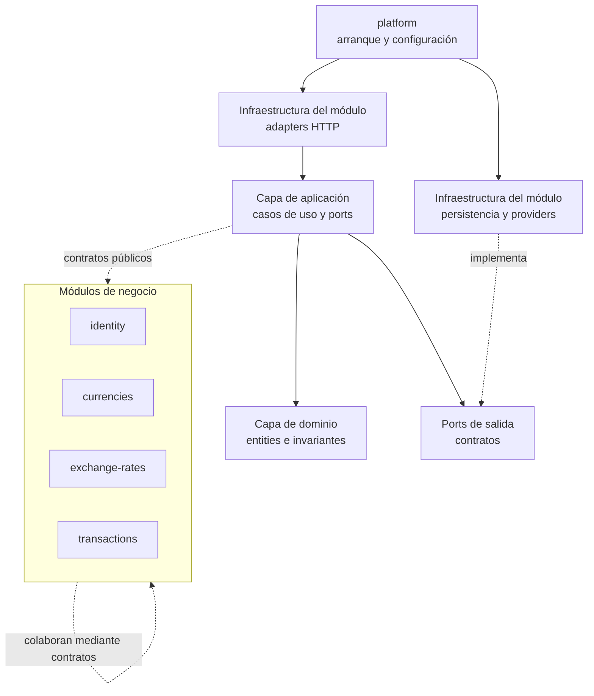

# Límites de los módulos

```mermaid
flowchart TB
    Platform[platform\narranque y configuración]
    Inbound[Infraestructura del módulo\nadapters HTTP]
    Application[Capa de aplicación\ncasos de uso y ports]
    Domain[Capa de dominio\nentities e invariantes]
    Ports[Ports de salida\ncontratos]
    Outbound[Infraestructura del módulo\npersistencia y providers]

    Platform --> Inbound
    Platform --> Outbound
    Inbound --> Application
    Application --> Domain
    Application --> Ports
    Outbound -. implementa .-> Ports

    subgraph Modules[Módulos de negocio]
        Identity[identity]
        Currencies[currencies]
        Rates[exchange-rates]
        Transactions[transactions]
    end

    Application -. contratos públicos .-> Modules
    Modules -. colaboran mediante contratos .-> Modules
```

Las relaciones punteadas representan contratos explícitos de aplicación, no
acceso directo a la infraestructura o a los modelos de persistencia de otro
módulo.
