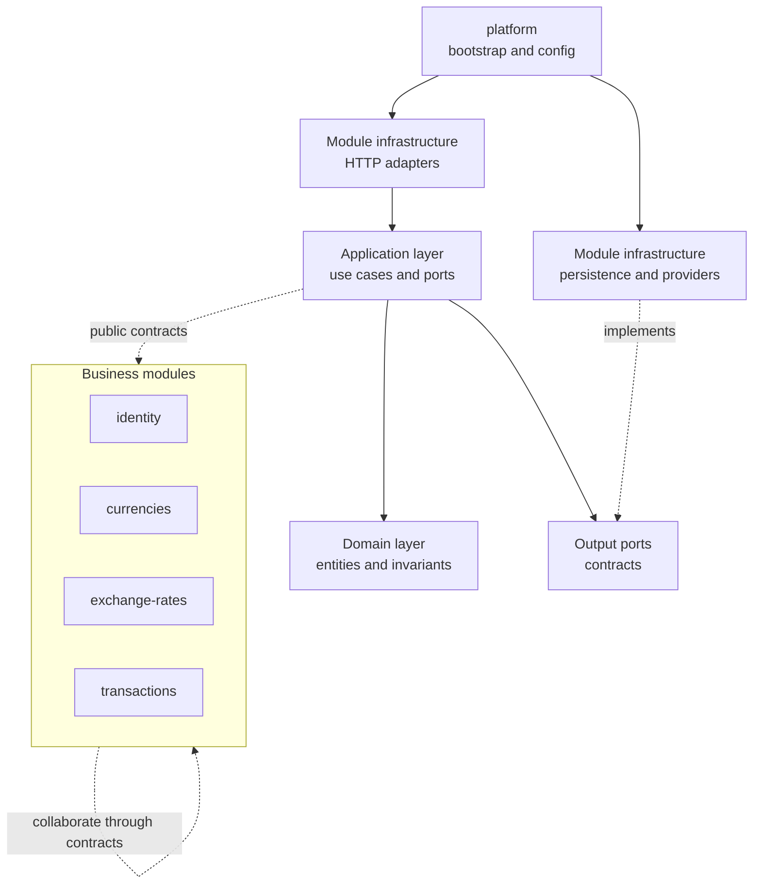

# Module Boundaries

```mermaid
flowchart TB
    Platform[platform\nbootstrap and config]
    Inbound[Module infrastructure\nHTTP adapters]
    Application[Application layer\nuse cases and ports]
    Domain[Domain layer\nentities and invariants]
    Ports[Output ports\ncontracts]
    Outbound[Module infrastructure\npersistence and providers]

    Platform --> Inbound
    Platform --> Outbound
    Inbound --> Application
    Application --> Domain
    Application --> Ports
    Outbound -. implements .-> Ports

    subgraph Modules[Business modules]
        Identity[identity]
        Currencies[currencies]
        Rates[exchange-rates]
        Transactions[transactions]
    end

    Application -. public contracts .-> Modules
    Modules -. collaborate through contracts .-> Modules
```

The dotted relationships represent explicit application contracts, not direct
access to another module's infrastructure or persistence models.
