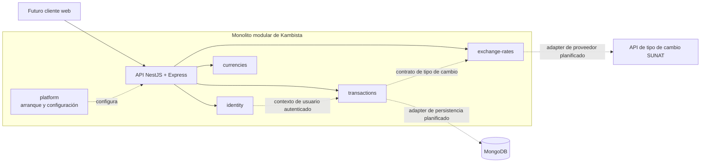

# Contexto del sistema

Las integraciones externas y los módulos de negocio mostrados aquí pertenecen
a la arquitectura planificada. No están todos implementados en el scaffold
actual.

```mermaid
flowchart LR
    Client[Futuro cliente web] --> Http[API NestJS + Express]

    subgraph Backend[Monolito modular de Kambista]
        Http --> Identity[identity]
        Http --> Currencies[currencies]
        Http --> Rates[exchange-rates]
        Http --> Transactions[transactions]

        Transactions -. contrato de tipo de cambio .-> Rates
        Identity -. contexto de usuario autenticado .-> Transactions
        Platform[platform\narranque y configuración]
    end

    Platform -. configura .-> Http
    Rates -. adapter de proveedor planificado .-> Sunat[API de tipo de cambio SUNAT]
    Transactions -. adapter de persistencia planificado .-> MongoDB[(MongoDB)]
```
