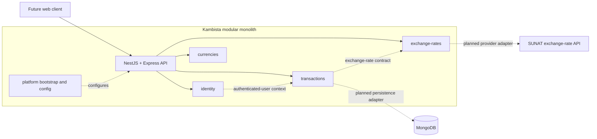

# System Context

The external integrations and business modules shown here are part of the
planned architecture. They are not implemented in the current scaffold.

```mermaid
flowchart LR
    Client[Future web client] --> Http[NestJS + Express API]

    subgraph Backend[Kambista modular monolith]
        Http --> Identity[identity]
        Http --> Currencies[currencies]
        Http --> Rates[exchange-rates]
        Http --> Transactions[transactions]

        Transactions -. exchange-rate contract .-> Rates
        Identity -. authenticated-user context .-> Transactions
        Platform[platform bootstrap and config]
    end

    Platform -. configures .-> Http
    Rates -. planned provider adapter .-> Sunat[SUNAT exchange-rate API]
    Transactions -. planned persistence adapter .-> MongoDB[(MongoDB)]
```
